## System environment
The following flowchart depicts the system environment.

The [Helm charts](../charts/mapp/README.md) describes the system environment.

#### Setup
First launch Rancher Desktop with Kubernetes enabled.

Now execute the following steps:
###### Create the images
```shell
$ ./gradlew dockerBuild dockerBuildNative
```
###### Install chart
```shell
$ kubectl create namespace mapp-test
$ helm --namespace mapp-test upgrade --install mapp ./charts/mapp
```
###### Run integration tests
```shell
$ helm --namespace mapp-test test mapp
```
###### Uninstall chart
```shell
$ helm --namespace mapp-test uninstall mapp
$ kubectl delete namespace mapp-test
```
